# Multi-Tenant Task Management System

A full-stack, real-time task management platform built for teams. It supports multi-tenancy (company isolation), role-based access control, Kanban boards with drag-and-drop, real-time notifications, comment mentions, and a comprehensive audit trail.

---

## Table of Contents

- [Project Overview](#project-overview)
- [Features](#features)
- [Architecture Diagram](#architecture-diagram)
- [Tech Stack](#tech-stack)
- [Folder Structure](#folder-structure)
- [API Endpoints](#api-endpoints)
- [Database Schema](#database-schema)
- [How to Run Locally](#how-to-run-locally)
- [Environment Variables](#environment-variables)
- [Screenshots](#screenshots)

---

## Project Overview

This application allows organizations to manage projects, tasks, and team collaboration in an isolated, multi-tenant environment. Each company's data is completely separated via a `companyId` field on every document. The first user to sign up for a company automatically becomes the **ADMIN**, and subsequent users join as **MEMBER** or **MANAGER**.

Key highlights:

- **Multi-tenancy** — Data isolation per company at the database query level
- **RBAC** — 3 roles (ADMIN, MANAGER, MEMBER) with 40+ granular permissions
- **Real-time** — Socket.io delivers instant notifications
- **Kanban** — Drag-and-drop board with validated status transitions
- **Audit Trail** — Every significant action is logged for compliance

---

## Features

### Authentication & Authorization
- JWT-based authentication (7-day token expiry)
- Signup with automatic company creation or join existing company
- Role-based access control — ADMIN, MANAGER, MEMBER
- Granular permission system across all resources
- Auto-logout on token expiry

### Project Management
- Create, update, and archive projects
- Add/remove team members
- Project status tracking (Active, Archived, Completed)
- Progress percentage calculation per project

### Task Management
- Full CRUD with soft deletes
- Priority levels — LOW, MEDIUM, HIGH, URGENT
- Due date tracking with overdue detection
- Validated status transitions:
  ```
  TODO → IN_PROGRESS
  IN_PROGRESS → IN_REVIEW / TODO / BLOCKER
  IN_REVIEW → DONE / IN_PROGRESS / BLOCKER
  DONE → TODO (reopen)
  BLOCKER → TODO / IN_PROGRESS (ADMIN/MANAGER only)
  ```
- Task assignment and reassignment
- Multi-filter search (status, priority, project, assignee, date range)

### Kanban Board
- Drag-and-drop task cards between status columns
- Priority color coding and assignee avatars
- Overdue task highlighting
- Client + server-side transition validation

### Comments & Mentions
- Threaded comments on tasks
- `@"Full Name"` or `@name` mention syntax
- Automatic notifications to mentioned users

### Real-Time Notifications
- Socket.io push notifications
- Notification types — task assigned, status changed, comment added, mentioned
- Mark as read / mark all as read
- Unread count badge
- Optional email notifications via SMTP

### Dashboard
- Summary stats — total projects, tasks, overdue count, open tasks
- Tasks grouped by status (bar chart)
- My Tasks and Overdue Tasks sections
- Project progress with completion percentages
- Role-specific data filtering

### Audit Log
- 14 tracked action types (project/task/comment CRUD, assignments, status changes)
- Admin-only audit log viewer with filtering and pagination
- Metadata storage for context on each action

### Security
- Helmet.js security headers
- Rate limiting (30 req/15min auth, 1000 req/15min API)
- NoSQL injection prevention (mongo-sanitize)
- HTTP parameter pollution protection
- Input validation on all endpoints (express-validator)
- Soft deletes to preserve data integrity

---

## Architecture Diagram

```
┌─────────────────────────────────────────────────────────────────┐
│                        FRONTEND (React 19)                      │
│                                                                 │
│  ┌──────────┐  ┌──────────┐  ┌──────────┐  ┌───────────────┐   │
│  │  Pages   │  │Components│  │ Context  │  │    Styles     │   │
│  │          │  │          │  │          │  │               │   │
│  │ Login    │  │ Navbar   │  │ Auth     │  │ Auth.css      │   │
│  │ Signup   │  │ Modal    │  │ Context  │  │ Dashboard.css │   │
│  │ Dashboard│  │ Kanban   │  │          │  │ Kanban.css    │   │
│  │ Projects │  │ Toast    │  │          │  │ Tasks.css     │   │
│  │ Tasks    │  │ Notif    │  │          │  │ ...           │   │
│  │ Users    │  │ Bell     │  │          │  │               │   │
│  │ AuditLog │  │Protected │  │          │  │               │   │
│  │ ...      │  │ Route    │  │          │  │               │   │
│  └──────────┘  └──────────┘  └──────────┘  └───────────────┘   │
│         │              │                                        │
│         ▼              ▼                                        │
│  ┌─────────────────────────────┐                                │
│  │     api.js (Axios)          │◄──── JWT Token (localStorage)  │
│  └──────────┬──────────────────┘                                │
│             │  HTTP + WebSocket                                  │
└─────────────┼───────────────────────────────────────────────────┘
              │
              ▼
┌─────────────────────────────────────────────────────────────────┐
│                     BACKEND (Node.js + Express)                 │
│                                                                 │
│  ┌──────────────────────────────────────────────────────────┐   │
│  │                     Middleware Stack                      │   │
│  │  Helmet │ CORS │ Rate Limit │ Sanitize │ HPP │ Validate  │   │
│  └──────────────────────────────────────────────────────────┘   │
│                              │                                  │
│  ┌──────────────────────────────────────────────────────────┐   │
│  │                   Auth Middleware                         │   │
│  │            protect → authorize/permit                    │   │
│  └──────────────────────────────────────────────────────────┘   │
│                              │                                  │
│  ┌──────────────────────────────────────────────────────────┐   │
│  │                       Routes                             │   │
│  │  /auth  /users  /projects  /tasks  /comments             │   │
│  │  /notifications  /activity-logs  /dashboard              │   │
│  └──────────────────────────────────────────────────────────┘   │
│         │                                    │                  │
│         ▼                                    ▼                  │
│  ┌──────────────┐                  ┌──────────────────┐         │
│  │   Services   │                  │   Socket.io      │         │
│  │              │                  │                  │         │
│  │ Notification │─── emit ────────►│  Real-time push  │         │
│  │ Email        │                  │  to user rooms   │         │
│  └──────────────┘                  └──────────────────┘         │
│         │                                                       │
│         ▼                                                       │
│  ┌──────────────────────────────────────────────────────────┐   │
│  │                   Mongoose Models                        │   │
│  │  User │ Company │ Project │ Task │ Comment               │   │
│  │  Notification │ ActivityLog                              │   │
│  └──────────────────────────────────────────────────────────┘   │
│                              │                                  │
└──────────────────────────────┼──────────────────────────────────┘
                               │
                               ▼
                    ┌─────────────────────┐
                    │     MongoDB         │
                    │                     │
                    │  Multi-tenant data  │
                    │  isolated by        │
                    │  companyId          │
                    └─────────────────────┘
```

---

## Tech Stack

| Layer        | Technology                                                    |
| ------------ | ------------------------------------------------------------- |
| **Frontend** | React 19, React Router DOM 7, Axios, Socket.io-client         |
| **UI/DnD**   | @hello-pangea/dnd (drag-and-drop for Kanban)                  |
| **Backend**  | Node.js, Express 4, Socket.io                                 |
| **Database** | MongoDB with Mongoose 8 ODM                                   |
| **Auth**     | JSON Web Tokens (jsonwebtoken), bcryptjs                      |
| **Security** | Helmet, express-rate-limit, express-mongo-sanitize, hpp       |
| **Validation** | express-validator                                           |
| **Logging**  | Winston (file + console transports)                           |
| **Email**    | Nodemailer (optional SMTP)                                    |
| **Dev Tools** | Nodemon, Create React App                                    |

---

## Folder Structure

```
multi-tenant-task-management-system/
│
├── backend/
│   ├── config/
│   │   ├── db.js                  # MongoDB connection
│   │   ├── logger.js              # Winston logger setup
│   │   └── roles.js               # RBAC roles & permissions
│   │
│   ├── middleware/
│   │   ├── auth.js                # JWT protect, authorize, permit
│   │   ├── errorHandler.js        # Centralized error handling
│   │   ├── rateLimiter.js         # API & auth rate limiters
│   │   └── validate.js            # Express-validator rules
│   │
│   ├── models/
│   │   ├── User.js                # User schema + soft delete
│   │   ├── Company.js             # Company/tenant schema
│   │   ├── Project.js             # Project schema + members
│   │   ├── Task.js                # Task schema + status flow
│   │   ├── Comment.js             # Comment schema + mentions
│   │   ├── Notification.js        # Notification (polymorphic)
│   │   └── ActivityLog.js         # Audit log schema
│   │
│   ├── routes/
│   │   ├── auth.js                # Signup, login, me
│   │   ├── users.js               # User CRUD + role mgmt
│   │   ├── projects.js            # Project CRUD + members
│   │   ├── tasks.js               # Task CRUD + assign
│   │   ├── comments.js            # Comments + mentions
│   │   ├── notifications.js       # Notification management
│   │   ├── activityLogs.js        # Audit log retrieval
│   │   └── dashboard.js           # Dashboard aggregations
│   │
│   ├── services/
│   │   ├── notificationService.js # Create + emit + email
│   │   └── emailService.js        # Nodemailer templates
│   │
│   ├── scripts/                   # Seed & test scripts
│   ├── logs/                      # Winston log files
│   ├── server.js                  # App entry point
│   ├── package.json
│   └── .env                       # Environment variables
│
├── frontend/
│   ├── public/
│   ├── src/
│   │   ├── components/
│   │   │   ├── KanbanBoard.jsx    # Drag-and-drop board
│   │   │   ├── Modal.jsx          # Reusable modal
│   │   │   ├── Navbar.jsx         # Navigation + logout
│   │   │   ├── NotificationBell.jsx # Real-time notifications
│   │   │   ├── ProtectedRoute.jsx # Auth guard
│   │   │   └── Toast.jsx          # Toast notifications
│   │   │
│   │   ├── context/
│   │   │   └── AuthContext.jsx    # Global auth state
│   │   │
│   │   ├── pages/
│   │   │   ├── Login.jsx          # Login form
│   │   │   ├── Signup.jsx         # Signup + company join
│   │   │   ├── Welcome.jsx        # Landing page
│   │   │   ├── Dashboard.jsx      # Stats & overview
│   │   │   ├── Projects.jsx       # Project list
│   │   │   ├── ProjectDetail.jsx  # Project detail + members
│   │   │   ├── Tasks.jsx          # Task list + Kanban toggle
│   │   │   ├── TaskDetail.jsx     # Task detail + comments
│   │   │   ├── Users.jsx          # User management
│   │   │   └── AuditLog.jsx       # Activity log viewer
│   │   │
│   │   ├── styles/                # CSS files per component
│   │   ├── api.js                 # Axios instance + interceptors
│   │   ├── App.js                 # Router configuration
│   │   └── index.js               # React entry point
│   │
│   ├── package.json
│   └── build/                     # Production build output
│
└── README.md
```

---

## API Endpoints

### Authentication — `/api/auth`

| Method | Endpoint            | Description                  | Auth |
| ------ | ------------------- | ---------------------------- | ---- |
| GET    | `/check-company`    | Check if company name exists | No   |
| POST   | `/signup`           | Register user + create/join company | No |
| POST   | `/login`            | Authenticate and receive JWT | No   |
| GET    | `/me`               | Get current user profile     | Yes  |

### Users — `/api/users`

| Method | Endpoint         | Description          | Role Required     |
| ------ | ---------------- | -------------------- | ----------------- |
| GET    | `/`              | List company users   | All authenticated |
| GET    | `/:id`           | Get user by ID       | All authenticated |
| PUT    | `/:id/role`      | Update user role     | ADMIN             |
| DELETE | `/:id`           | Soft delete user     | ADMIN             |

### Projects — `/api/projects`

| Method | Endpoint              | Description              | Role Required   |
| ------ | --------------------- | ------------------------ | --------------- |
| GET    | `/`                   | List projects            | All (filtered)  |
| GET    | `/:id`                | Get project details      | All authenticated |
| POST   | `/`                   | Create project           | ADMIN, MANAGER  |
| PUT    | `/:id`                | Update project           | ADMIN, MANAGER  |
| POST   | `/:id/members`        | Add members              | ADMIN, MANAGER  |
| DELETE | `/:id/members/:userId`| Remove member            | ADMIN, MANAGER  |
| DELETE | `/:id`                | Soft delete project      | ADMIN, MANAGER  |

### Tasks — `/api/tasks`

| Method | Endpoint        | Description                    | Role Required      |
| ------ | --------------- | ------------------------------ | ------------------ |
| GET    | `/`             | List tasks (with filters)      | All (filtered)     |
| GET    | `/:id`          | Get task details               | All authenticated  |
| POST   | `/`             | Create task                    | ADMIN, MANAGER     |
| PUT    | `/:id`          | Update task                    | All (restrictions) |
| PATCH  | `/:id/assign`   | Assign/reassign task           | ADMIN, MANAGER     |
| DELETE | `/:id`          | Soft delete task               | ADMIN, MANAGER     |

**Query Parameters:** `search`, `projectId`, `status`, `priority`, `assignedTo`, `dueBefore`, `dueAfter`, `page`, `limit`

### Comments — `/api/comments`

| Method | Endpoint   | Description                        | Role Required     |
| ------ | ---------- | ---------------------------------- | ----------------- |
| GET    | `/`        | List comments for a task           | All authenticated |
| POST   | `/`        | Add comment (supports @mentions)   | All authenticated |
| DELETE | `/:id`     | Soft delete comment                | ADMIN, MANAGER    |

### Notifications — `/api/notifications`

| Method | Endpoint         | Description                   | Auth |
| ------ | ---------------- | ----------------------------- | ---- |
| GET    | `/`              | List notifications (paginated)| Yes  |
| GET    | `/unread-count`  | Get unread count              | Yes  |
| PATCH  | `/:id/read`      | Mark notification as read     | Yes  |
| PATCH  | `/read-all`      | Mark all as read              | Yes  |

### Activity Logs — `/api/activity-logs`

| Method | Endpoint | Description                | Role Required |
| ------ | -------- | -------------------------- | ------------- |
| GET    | `/`      | List audit log entries     | ADMIN         |

### Dashboard — `/api/dashboard`

| Method | Endpoint | Description              | Auth |
| ------ | -------- | ------------------------ | ---- |
| GET    | `/`      | Dashboard summary stats  | Yes  |

---

## Database Schema (ER Diagram)

### Mermaid ER Diagram

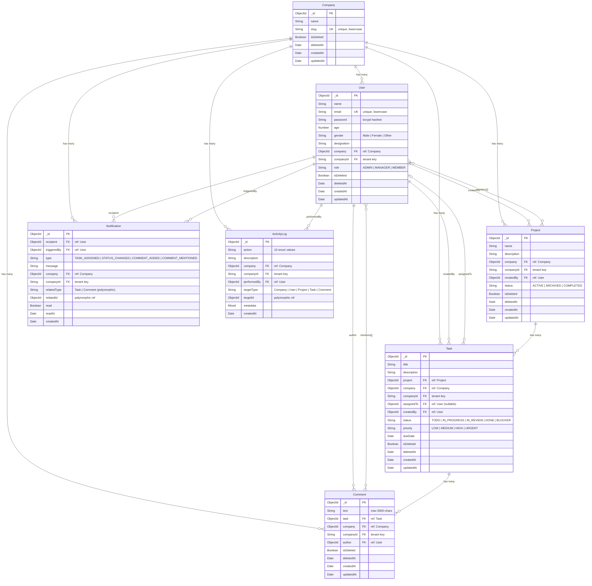

### dbdiagram.io Format

<details>
<summary>Click to expand dbdiagram.io code (paste at dbdiagram.io/d)</summary>

```dbml
Table Company {
  _id ObjectId [pk]
  name String [not null]
  slug String [unique, not null, note: "lowercase, URL-safe"]
  isDeleted Boolean [default: false]
  deletedAt Date
  createdAt Date
  updatedAt Date
}

Table User {
  _id ObjectId [pk]
  name String [not null]
  email String [unique, not null, note: "lowercase"]
  password String [not null, note: "bcrypt hashed"]
  age Number [not null]
  gender String [not null, note: "Male | Female | Other"]
  designation String [not null]
  company ObjectId [ref: > Company._id, not null]
  companyId String [not null, note: "tenant isolation key"]
  role String [default: "MEMBER", note: "ADMIN | MANAGER | MEMBER"]
  isDeleted Boolean [default: false]
  deletedAt Date
  createdAt Date
  updatedAt Date
}

Table Project {
  _id ObjectId [pk]
  name String [not null]
  description String [default: ""]
  company ObjectId [ref: > Company._id, not null]
  companyId String [not null, note: "tenant isolation key"]
  createdBy ObjectId [ref: > User._id, not null]
  status String [default: "ACTIVE", note: "ACTIVE | ARCHIVED | COMPLETED"]
  isDeleted Boolean [default: false]
  deletedAt Date
  createdAt Date
  updatedAt Date
}

Table ProjectMembers {
  project ObjectId [ref: > Project._id]
  user ObjectId [ref: > User._id]

  Note: "Embedded as members[] array in Project document"
}

Table Task {
  _id ObjectId [pk]
  title String [not null]
  description String [default: ""]
  project ObjectId [ref: > Project._id, not null]
  company ObjectId [ref: > Company._id, not null]
  companyId String [not null, note: "tenant isolation key"]
  assignedTo ObjectId [ref: > User._id, note: "nullable"]
  createdBy ObjectId [ref: > User._id, not null]
  status String [default: "TODO", note: "TODO | IN_PROGRESS | IN_REVIEW | DONE | BLOCKER"]
  priority String [default: "MEDIUM", note: "LOW | MEDIUM | HIGH | URGENT"]
  dueDate Date
  isDeleted Boolean [default: false]
  deletedAt Date
  createdAt Date
  updatedAt Date
}

Table Comment {
  _id ObjectId [pk]
  text String [not null, note: "max 5000 chars"]
  task ObjectId [ref: > Task._id, not null]
  company ObjectId [ref: > Company._id, not null]
  companyId String [not null, note: "tenant isolation key"]
  author ObjectId [ref: > User._id, not null]
  isDeleted Boolean [default: false]
  deletedAt Date
  createdAt Date
  updatedAt Date
}

Table CommentMentions {
  comment ObjectId [ref: > Comment._id]
  user ObjectId [ref: > User._id]

  Note: "Embedded as mentions[] array in Comment document"
}

Table Notification {
  _id ObjectId [pk]
  recipient ObjectId [ref: > User._id, not null]
  triggeredBy ObjectId [ref: > User._id, not null]
  type String [not null, note: "TASK_ASSIGNED | TASK_STATUS_CHANGED | COMMENT_ADDED | COMMENT_MENTIONED"]
  message String [not null]
  company ObjectId [ref: > Company._id, not null]
  companyId String [not null, note: "tenant isolation key"]
  relatedType String [note: "Task | Comment (polymorphic)"]
  relatedId ObjectId [note: "polymorphic reference"]
  read Boolean [default: false]
  readAt Date
  createdAt Date
}

Table ActivityLog {
  _id ObjectId [pk]
  action String [not null, note: "13 enum values"]
  description String [default: ""]
  company ObjectId [ref: > Company._id, not null]
  companyId String [not null, note: "tenant isolation key"]
  performedBy ObjectId [ref: > User._id, not null]
  targetType String [note: "Company | User | Project | Task | Comment"]
  targetId ObjectId [note: "polymorphic reference"]
  metadata Mixed [note: "flexible context data"]
  createdAt Date
}
```

</details>

### Relationships Summary

| From         | To       | Cardinality | Field            | Description                        |
| ------------ | -------- | ----------- | ---------------- | ---------------------------------- |
| Company      | User     | 1 : N       | `User.company`   | Users belong to one company        |
| Company      | Project  | 1 : N       | `Project.company`| Projects belong to one company     |
| Company      | Task     | 1 : N       | `Task.company`   | Tasks belong to one company        |
| User         | Project  | 1 : N       | `Project.createdBy` | User creates many projects      |
| User         | Project  | N : M       | `Project.members[]` | Users join many projects        |
| User         | Task     | 1 : N       | `Task.createdBy`    | User creates many tasks         |
| User         | Task     | 1 : N       | `Task.assignedTo`   | User is assigned many tasks     |
| Project      | Task     | 1 : N       | `Task.project`      | Project contains many tasks     |
| Task         | Comment  | 1 : N       | `Comment.task`      | Task has many comments          |
| User         | Comment  | 1 : N       | `Comment.author`    | User writes many comments       |
| User         | Comment  | N : M       | `Comment.mentions[]`| Users mentioned in comments     |
| User         | Notification | 1 : N   | `Notification.recipient`  | User receives notifications |
| User         | Notification | 1 : N   | `Notification.triggeredBy`| User triggers notifications |
| User         | ActivityLog  | 1 : N   | `ActivityLog.performedBy` | User performs logged actions |

### Architecture Notes

- **Multi-tenancy enforcement**: Every document carries both a `company` (ObjectId ref) and `companyId` (string slug). All database queries filter by `companyId`, ensuring complete data isolation between organizations at the query level — Org A can never see Org B's data.
- **Single-company users**: Each user belongs to exactly one company. The first user to sign up with a new company name automatically becomes the **ADMIN**; subsequent users join as **MEMBER** or **MANAGER**.
- **RBAC without a separate roles table**: Roles (`ADMIN`, `MANAGER`, `MEMBER`) are stored directly on the User document. A centralized `config/roles.js` file maps 40+ granular permissions to roles, checked at the middleware layer via `permit()` and `authorize()`.
- **Soft deletes**: All core entities (User, Company, Project, Task, Comment) use an `isDeleted` / `deletedAt` pattern instead of hard deletes. A Mongoose `pre(/^find/)` hook automatically excludes soft-deleted documents from all queries.
- **Polymorphic references**: `Notification` and `ActivityLog` use a `relatedType` + `relatedId` (or `targetType` + `targetId`) pattern to reference different entity types (Task, Comment, Project, etc.) without separate foreign keys for each.
- **Compound indexes**: Performance-critical queries use compound indexes that include `companyId` + `isDeleted` + sort/filter fields (e.g., `{ companyId: 1, isDeleted: 1, status: 1, createdAt: -1 }` on Task) to efficiently serve tenant-scoped, filtered, paginated queries.

---

## How to Run Locally

### Prerequisites

- **Node.js** v18 or higher
- **MongoDB** running locally or a MongoDB Atlas connection string
- **npm** or **yarn**

### 1. Clone the Repository

```bash
git clone https://github.com/akankshakarhad/multi-tenant-task-management-system.git
cd multi-tenant-task-management-system
```

### 2. Set Up the Backend

```bash
cd backend
npm install
```

Create a `.env` file in the `backend/` directory (see [Environment Variables](#environment-variables) below).

Start the server:

```bash
# Development (with hot reload)
npm run dev

# Production
npm start
```

The backend runs on **http://localhost:5000**.

### 3. Set Up the Frontend

```bash
cd frontend
npm install
npm start
```

The frontend runs on **http://localhost:3000**.

### 4. Seed the Database (Optional)

```bash
cd backend
node scripts/seed.js
```

### 5. Open the App

Navigate to **http://localhost:3000** in your browser. Sign up with a new company name to get started as an ADMIN.

---

## Environment Variables

Create a `backend/.env` file with the following:

```env
# MongoDB
MONGO_URI=mongodb://localhost:27017/task-management

# JWT
JWT_SECRET=your-secret-key-here

# Server
PORT=5000
NODE_ENV=development
LOG_LEVEL=info

# CORS
CORS_ORIGIN=http://localhost:3000

# SMTP (optional — app works without it)
SMTP_HOST=smtp.gmail.com
SMTP_PORT=587
SMTP_USER=your-email@gmail.com
SMTP_PASS=your-app-password

# Frontend URL (used in email templates)
FRONTEND_URL=http://localhost:3000
```

---

## API Documentation

Swagger UI is available at **http://localhost:5000/api-docs/** once the backend is running. You can explore and test all API endpoints interactively.

---

## Screenshots

### Login Page


### Dashboard
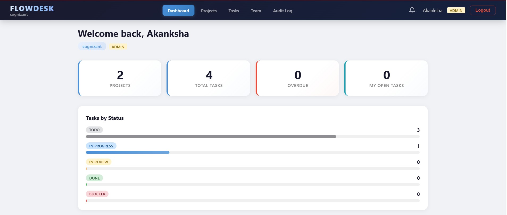
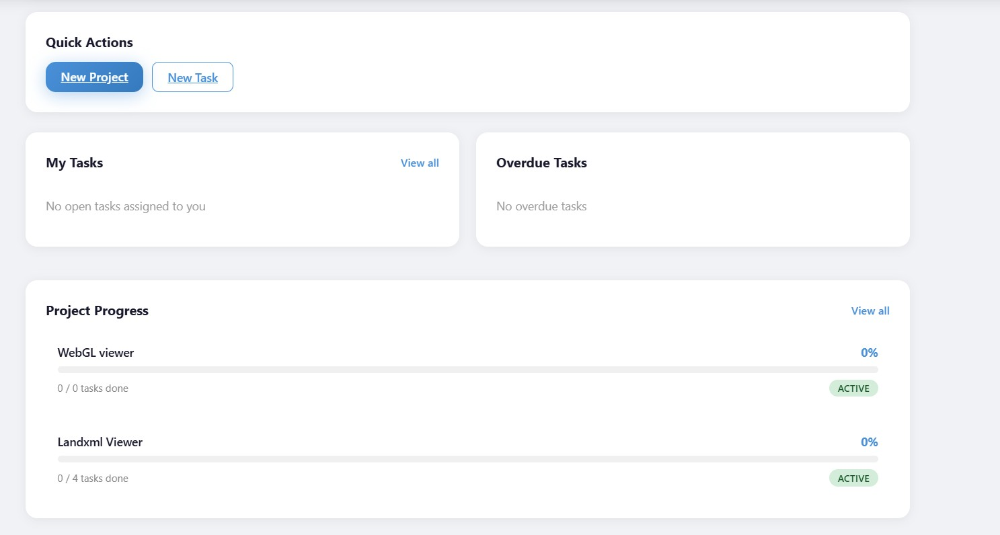

### Task Management
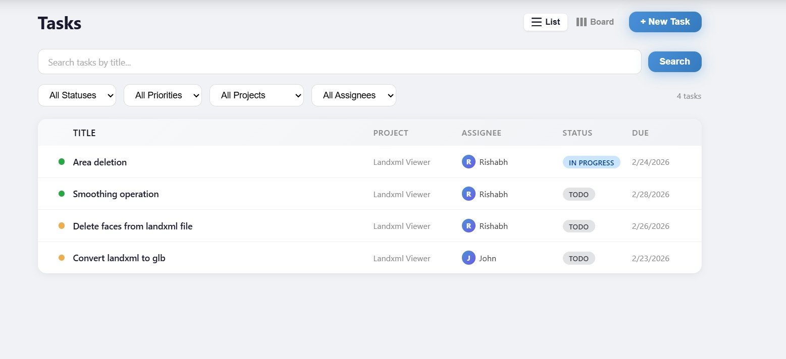
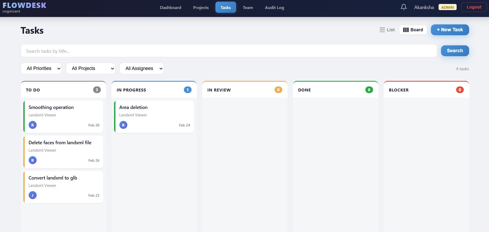

### Role-Based Access Control (RBAC)
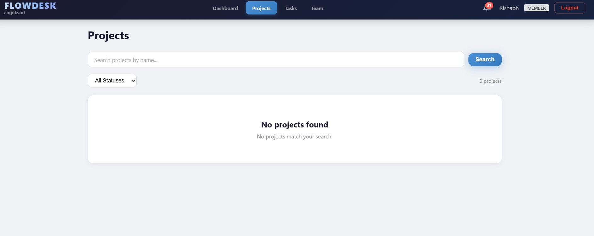
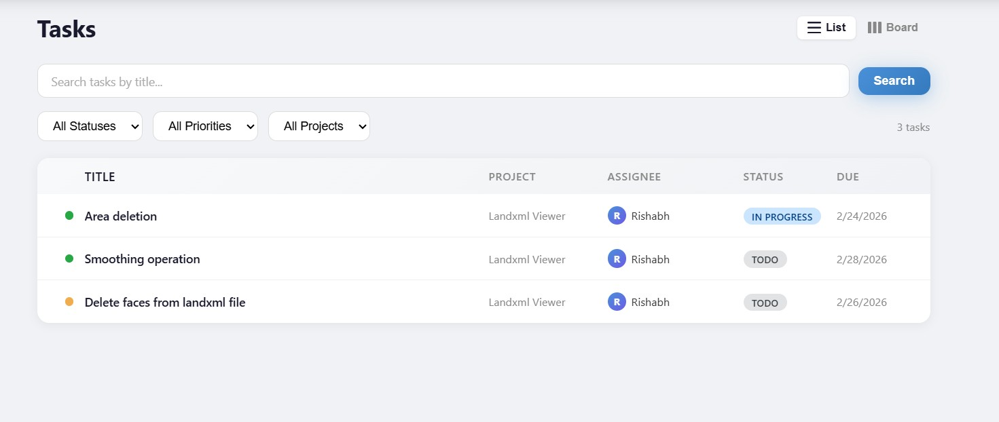

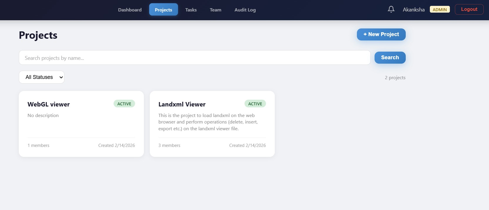

### Multi-Tenant Isolation
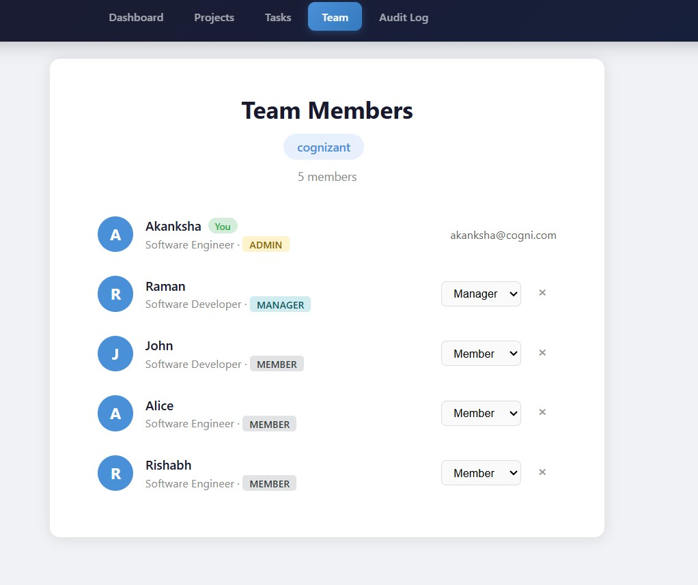
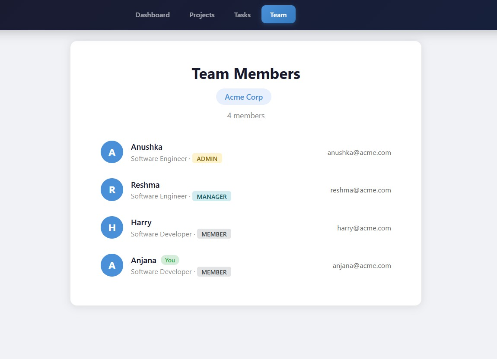

### Notifications
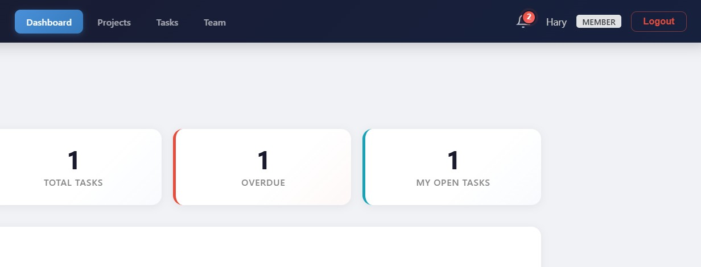


### Audit Logs
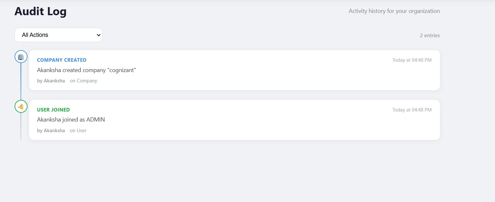
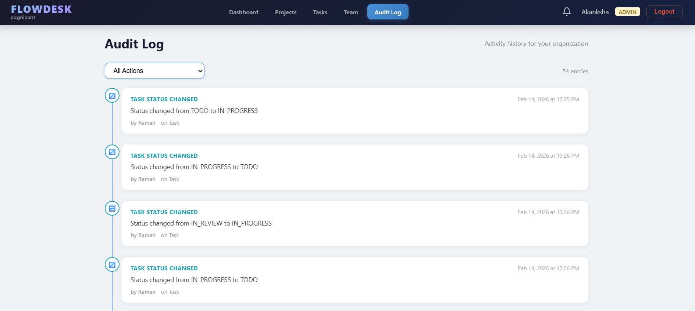

### API Documentation (Swagger)
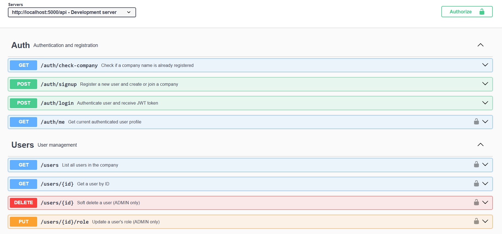
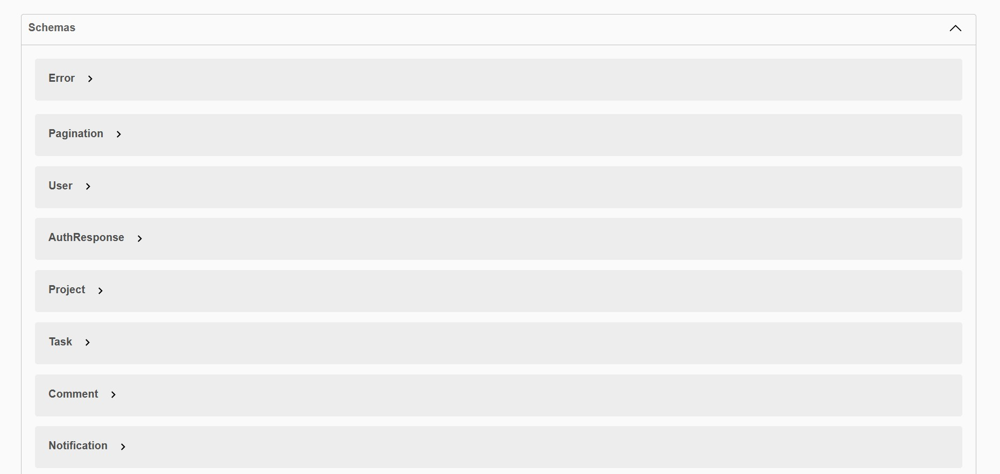
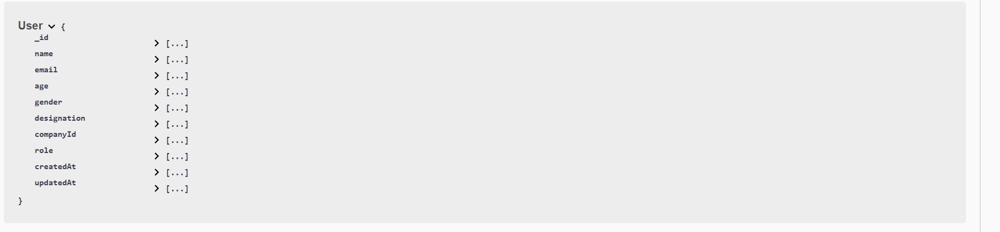
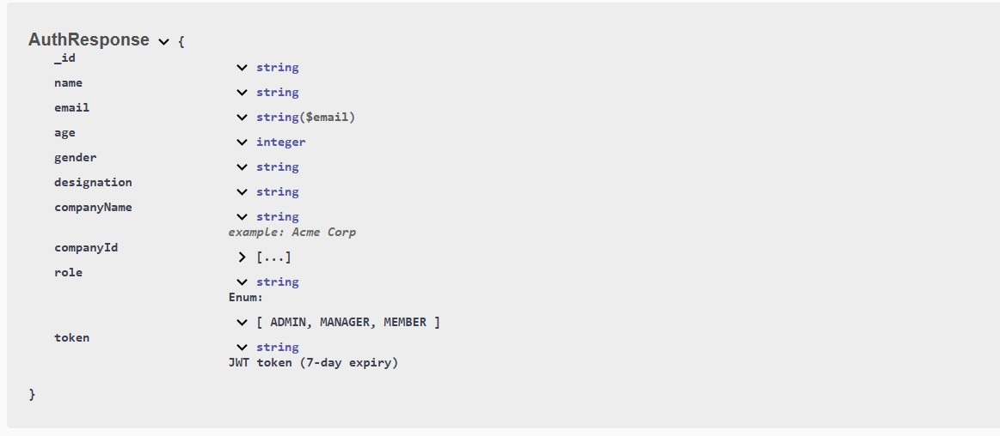
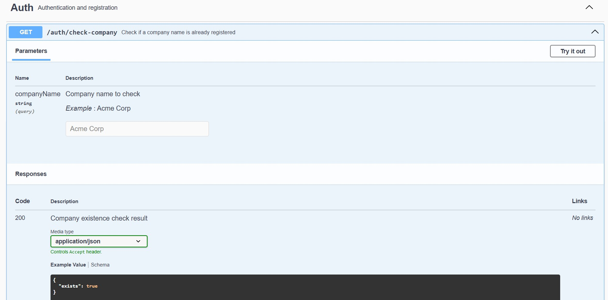
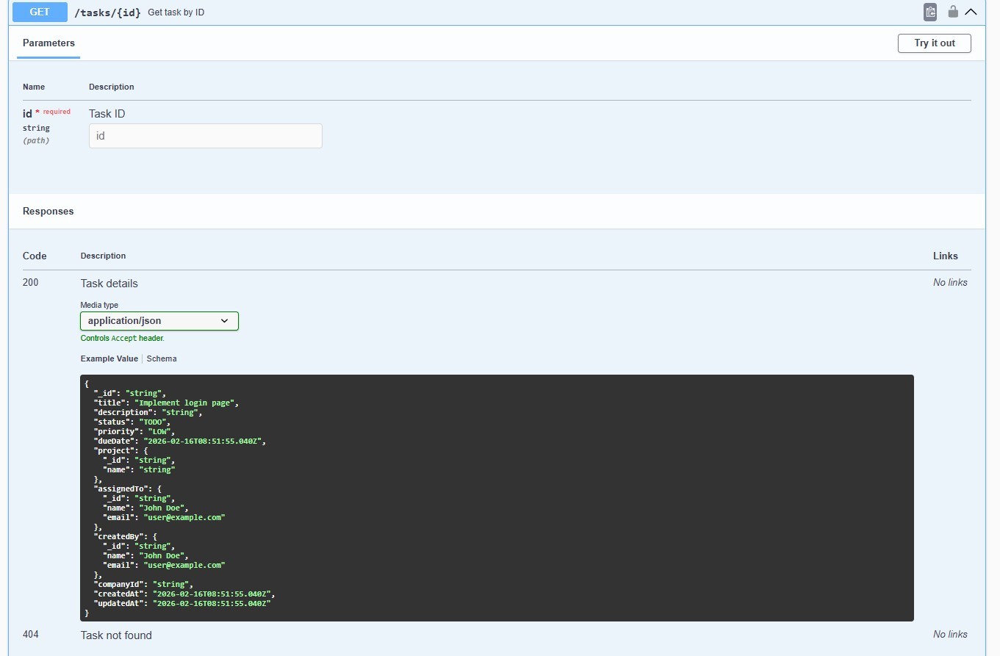

### Database Management
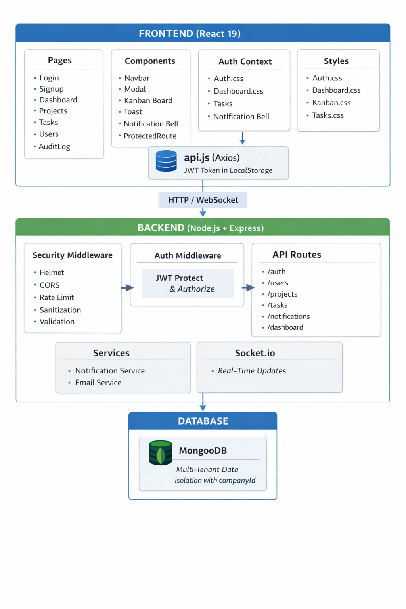

---

## License

This project is for educational and portfolio purposes.
